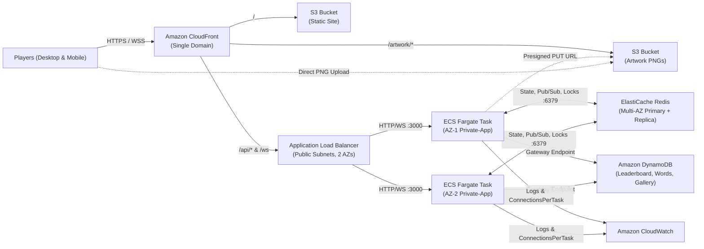
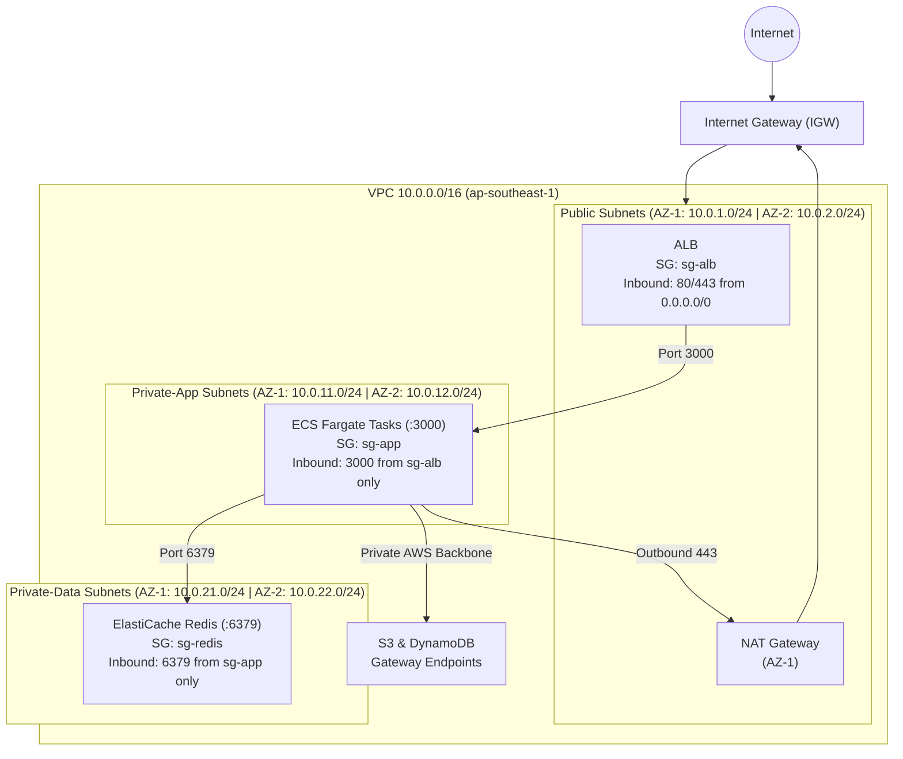

# CloudDraw Architecture & Network Diagrams

## 1. Full Target AWS Architecture

```mermaid
flowchart LR
    User["Players (Desktop & Mobile)"] -->|HTTPS / WSS| CF["Amazon CloudFront\n(Single Domain)"]

    CF -->|"/"| S3Site["S3 Bucket\n(Static Site)"]
    CF -->|"/artwork/*"| S3Art["S3 Bucket\n(Artwork PNGs)"]
    CF -->|"/api/* & /ws"| ALB["Application Load Balancer\n(Public Subnets, 2 AZs)"]

    ALB -->|"HTTP/WS :3000"| ECS1["ECS Fargate Task\n(AZ-1 Private-App)"]
    ALB -->|"HTTP/WS :3000"| ECS2["ECS Fargate Task\n(AZ-2 Private-App)"]

    ECS1 <-->|"State, Pub/Sub, Locks :6379"| Redis["ElastiCache Redis\n(Multi-AZ Primary + Replica)"]
    ECS2 <-->|"State, Pub/Sub, Locks :6379"| Redis

    ECS1 -->|"Gateway Endpoint"| DDB["Amazon DynamoDB\n(Leaderboard, Words, Gallery)"]
    ECS2 -->|"Gateway Endpoint"| DDB

    ECS1 -.->|"Presigned PUT URL"| S3Art
    User -.->|"Direct PNG Upload"| S3Art

    ECS1 -->|"Logs & ConnectionsPerTask"| CW["Amazon CloudWatch"]
    ECS2 -->|"Logs & ConnectionsPerTask"| CW
```

---

## 2. VPC, Subnets, and Security Group Chain (`ap-southeast-1`)

```mermaid
flowchart TB
    Internet(("Internet")) --> IGW["Internet Gateway (IGW)"]
    IGW --> PublicSubnets

    subgraph VPC["VPC 10.0.0.0/16 (ap-southeast-1)"]
        subgraph PublicSubnets["Public Subnets (AZ-1: 10.0.1.0/24 | AZ-2: 10.0.2.0/24)"]
            ALB["ALB\nSG: sg-alb\nInbound: 80/443 from 0.0.0.0/0"]
            NAT["NAT Gateway\n(AZ-1)"]
        end

        subgraph AppSubnets["Private-App Subnets (AZ-1: 10.0.11.0/24 | AZ-2: 10.0.12.0/24)"]
            ECS["ECS Fargate Tasks (:3000)\nSG: sg-app\nInbound: 3000 from sg-alb only"]
        end

        subgraph DataSubnets["Private-Data Subnets (AZ-1: 10.0.21.0/24 | AZ-2: 10.0.22.0/24)"]
            Redis["ElastiCache Redis (:6379)\nSG: sg-redis\nInbound: 6379 from sg-app only"]
        end

        S3EP["S3 & DynamoDB\nGateway Endpoints"]
    end

    ALB -->|"Port 3000"| ECS
    ECS -->|"Port 6379"| Redis
    ECS -->|"Outbound 443"| NAT
    NAT --> IGW
    ECS -->|"Private AWS Backbone"| S3EP
```
